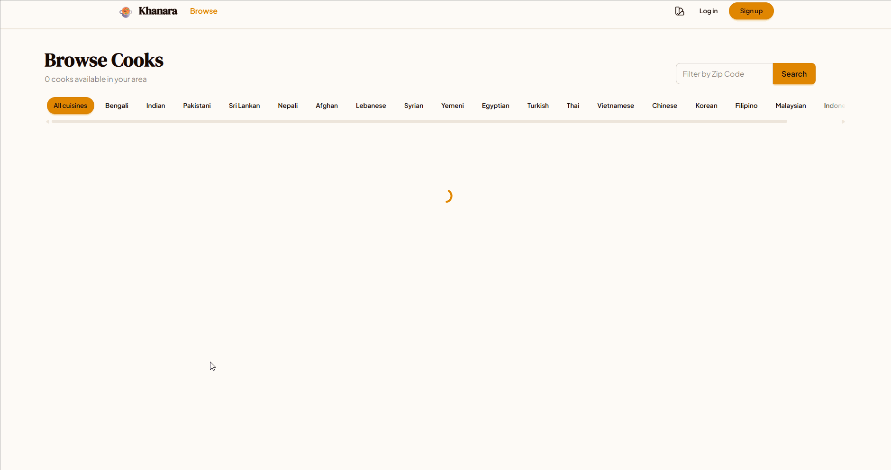

# Khanara

**🌐 Live site: [https://khanara.azurewebsites.net](https://khanara.azurewebsites.net/)** — ~~deployed on Azure App Service with Azure SQL Database.~~ **Currently down** — Azure free tier expired; redeployment pending. See the [demo gif](assets/khanara.gif) below.

A home-cooked food marketplace connecting home cooks with food enthusiasts, specializing in Asian and Arabian cuisines.

[](https://github.com/isomer04/khanara/actions/workflows/ci.yml)
[](LICENSE)
[](https://dotnet.microsoft.com/)
[](https://angular.dev/)
[](https://www.typescriptlang.org/)
[](https://tailwindcss.com/)
[](https://www.microsoft.com/sql-server)
[](https://stripe.com/)
[](https://cloudinary.com/)

### Demo

While the live site is down, here's a walkthrough of the app:



---

## What is Khanara?

Khanara lets home cooks list their dishes, set daily portions, and receive orders — while customers browse authentic home-cooked meals nearby, track their order in real time, and chat directly with cooks.

---

## Features

- **Browse & discover** dishes by cuisine, dietary tags, and cook rating
- **Real-time order tracking** with live status updates via SignalR
- **In-app messaging** between customers and cooks per order
- **Daily portion control** — automatic inventory with per-batch limits
- **Cook profiles** with kitchen photos, service zones, and availability toggle
- **Reviews & ratings** with cook replies
- **Favorites** and multi-item cart (with guest-to-auth merge)
- **Admin panel** for user, role, and content moderation
- **Role-based access** — `Eater`, `Cook`, `Moderator`, `Admin`

---

## Quick Start

### Prerequisites

- [.NET 10 SDK](https://dotnet.microsoft.com/download)
- [Node.js 24 (LTS)](https://nodejs.org/)
- [Docker](https://www.docker.com/) (runs the SQL Server database)
- [Cloudinary account](https://cloudinary.com/) (required for photo uploads)

### Database

SQL Server runs in Docker. Set a strong SA password and start the container:

```bash
# Create a .env file in the repo root (or set the variable in your shell)
echo SQL_SA_PASSWORD=YourStrong!Passw0rd > .env
docker compose up -d
```

SQL Server listens on `localhost:1434`.

### Backend

```bash
cd backend
copy appsettings.Development.json.example appsettings.Development.json
# Fill in the SQL password, TokenKey (64+ chars), Cloudinary, Stripe, and CORS values
dotnet ef database update
dotnet run
```

API: `https://localhost:7071` · Swagger: `https://localhost:7071/swagger`

### Frontend

```bash
cd client
npm install
npm start
```

App: `https://localhost:5444`

### Tests

```bash
# Frontend
cd client && npm run test:ci

# Backend
cd backend/Khanara.API.Tests && dotnet test
```

---

## Deployment

**🌐 Live: [khanara.azurewebsites.net](https://khanara.azurewebsites.net)** — ~~running on **Azure App Service** (Linux, .NET 10) with **Azure SQL Database**~~. Currently offline (Azure free tier expired). Pipeline and config in [docs/deployment.md](docs/deployment.md) are ready for redeploy on any new host.

The app **has been deployed before** on Azure App Service. See the [@docs/screenshots/](docs/screenshots/) folder for proof of past deployments — Azure overview (healthy web app on Linux/.NET 10), Deployment Center activity log, and GitHub Actions CI/CD runs.

Every push to `main` builds and deploys automatically via **GitHub Actions** using **OIDC federated credentials** — passwordless, with no publish-profile secrets stored. See [docs/deployment.md](docs/deployment.md) for the full pipeline, environment variables, and security checklist.

### Past deployments (screenshots)

| | |
|---|---|
|  |  |
| **Azure App Service overview** — khanara web app, Linux, .NET 10, last deploy June 10, 2026 | **Azure Deployment Center** — push and OneDeploy history, all succeeded |


---

## Documentation

| Guide | Description |
|---|---|
| [docs/configuration.md](docs/configuration.md) | All config keys, environment variables, and secrets |
| [docs/api-reference.md](docs/api-reference.md) | Endpoint reference, auth, roles, pagination, error shapes |
| [docs/architecture.md](docs/architecture.md) | System diagram, layer structure, auth flow, domain entities |
| [docs/deployment.md](docs/deployment.md) | Production build, database migration, Stripe webhooks, security checklist |
| [docs/CONTRIBUTING.md](docs/CONTRIBUTING.md) | Branching, commit style, PR guidelines, code standards |

---

## Project Structure

```
khanara/
├── .github/workflows/    # CI: build, test, lint, Trivy scan
├── backend/              # ASP.NET Core API (Controllers, Data, Services, SignalR)
│   └── Khanara.API.Tests/# xUnit tests (unit, integration, concurrency)
├── client/               # Angular SPA (features, core, shared, types)
├── docs/                 # Guides: config, API, architecture, deployment, contributing
├── LICENSE
└── README.md
```

---

## Contributing

Read [docs/CONTRIBUTING.md](docs/CONTRIBUTING.md) before opening a PR.

---

## License

[MIT](LICENSE)
