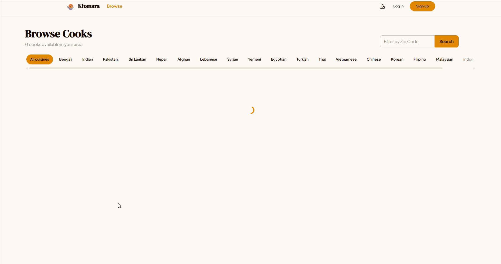
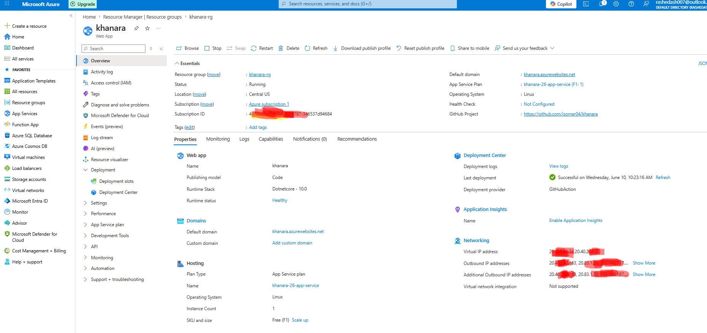
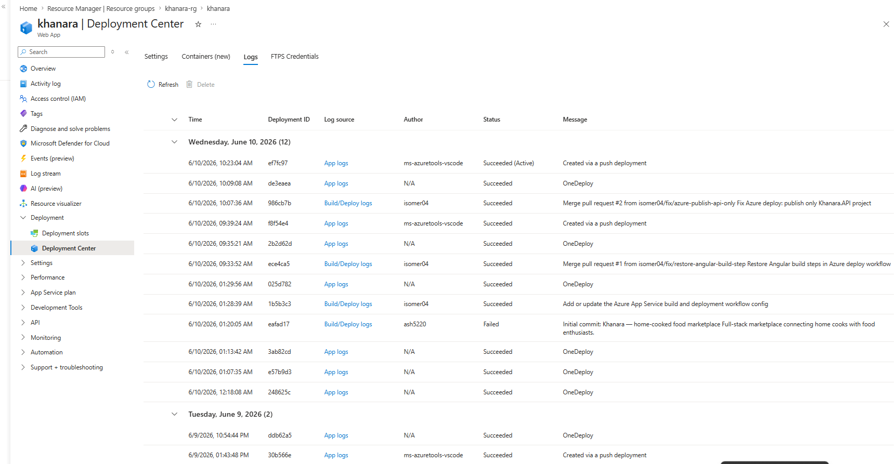
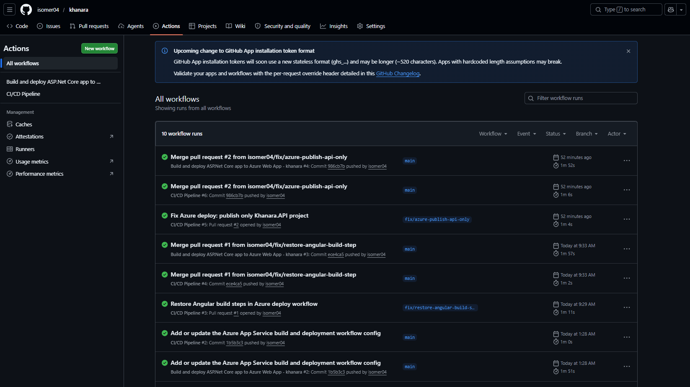

# Khanara

**🌐 Moving to Google Cloud: [https://khanara.shop](https://khanara.shop)** — Cloud Run + Cloud SQL, provisioned with Terraform ([plan](docs/gcp-deployment-plan.md)). The previous Azure deployment went offline when the free tier expired. See the [demo gif](assets/khanara.gif) below.

A home-cooked food marketplace connecting home cooks with food enthusiasts, specializing in Asian and Arabian cuisines.

[](https://github.com/isomer04/khanara/actions/workflows/ci.yml)
[](LICENSE)
[](https://dotnet.microsoft.com/)
[](https://angular.dev/)
[](https://www.typescriptlang.org/)
[](https://tailwindcss.com/)
[](https://www.postgresql.org/)
[](docs/gcp-deployment-plan.md)
[](infra/terraform)
[](https://stripe.com/)
[](https://cloudinary.com/)

### Demo

While the live site is down, here's a walkthrough of the app:



---

## What is Khanara?

Khanara lets home cooks list their dishes, set daily portions, and receive orders — while customers browse authentic home-cooked meals nearby, track their order in real time, and chat directly with cooks.

---

## Features

- **Browse & discover** dishes by cuisine, dietary tags, and cook rating
- **Real-time order tracking** with live status updates via SignalR
- **In-app messaging** between customers and cooks per order
- **Daily portion control** — automatic inventory with per-batch limits
- **Cook profiles** with kitchen photos, service zones, and availability toggle
- **Reviews & ratings** with cook replies
- **Favorites** and multi-item cart (with guest-to-auth merge)
- **Admin panel** for user, role, and content moderation
- **Role-based access** — `Eater`, `Cook`, `Moderator`, `Admin`

---

## Quick Start

### Prerequisites

- [.NET 10 SDK](https://dotnet.microsoft.com/download)
- [Node.js 24 (LTS)](https://nodejs.org/)
- [Docker](https://www.docker.com/) (runs the PostgreSQL database)
- [Cloudinary account](https://cloudinary.com/) (required for photo uploads)

### Database

PostgreSQL runs in Docker. Set a password and start the container:

```bash
# Create a .env file in the repo root (docker-compose.yml reads it; it is gitignored)
echo POSTGRES_PASSWORD=YourStrong!Passw0rd > .env
docker compose up -d
```

PostgreSQL listens on `localhost:5433`.

### Backend

```bash
cd backend
copy appsettings.Development.json.example appsettings.Development.json
# Fill in the Postgres password, TokenKey (64+ chars), Cloudinary, Stripe, and CORS values
dotnet ef database update
dotnet run
```

API: `https://localhost:7071` · Swagger: `https://localhost:7071/swagger`

### Frontend

```bash
cd client
npm install
npm start
```

App: `https://localhost:5444`

### Tests

```bash
# Frontend
cd client && npm run test:ci

# Backend
cd backend/Khanara.API.Tests && dotnet test
```

---

## Deployment

**Target: Google Cloud at [khanara.shop](https://khanara.shop).** One Cloud Run container (API + SPA) that scales to zero, Cloud SQL for PostgreSQL, Secret Manager, Cloud Scheduler for the background jobs, and Cloud DNS. All of it is defined in Terraform under [`infra/terraform/`](infra/terraform). It costs about $10–15/month, so the $300 free-trial credit covers the whole trial. See the [GCP deployment plan](docs/gcp-deployment-plan.md) for the architecture, costs and runbook.

When CI passes on `main`, [`deploy-gcp.yml`](.github/workflows/deploy-gcp.yml) builds the Docker image, pushes it to Artifact Registry and rolls out a new revision. It authenticates through **Workload Identity Federation**, so no service-account keys are stored. See [docs/deployment.md](docs/deployment.md) for environment variables, Stripe webhooks and the security checklist.

The app **has been deployed before** on Azure App Service with Azure SQL. See the [@docs/screenshots/](docs/screenshots/) folder for proof: the Azure overview (healthy web app on Linux/.NET 10), the Deployment Center activity log and GitHub Actions CI/CD runs.

### Past deployments (screenshots)

| | |
|---|---|
|  |  |
| **Azure App Service overview** — khanara web app, Linux, .NET 10, last deploy June 10, 2026 | **Azure Deployment Center** — push and OneDeploy history, all succeeded |



---

## Documentation

| Guide | Description |
|---|---|
| [docs/configuration.md](docs/configuration.md) | All config keys, environment variables, and secrets |
| [docs/api-reference.md](docs/api-reference.md) | Endpoint reference, auth, roles, pagination, error shapes |
| [docs/architecture.md](docs/architecture.md) | System diagram, layer structure, auth flow, domain entities |
| [docs/gcp-deployment-plan.md](docs/gcp-deployment-plan.md) | Google Cloud architecture, costs, Terraform layout, first-time runbook |
| [docs/deployment.md](docs/deployment.md) | Production build, database migration, Stripe webhooks, security checklist |
| [docs/CONTRIBUTING.md](docs/CONTRIBUTING.md) | Branching, commit style, PR guidelines, code standards |

---

## Project Structure

```
khanara/
├── .github/workflows/    # CI: build, test, lint, Trivy scan
├── backend/              # ASP.NET Core API (Controllers, Data, Services, SignalR)
│   └── Khanara.API.Tests/# xUnit tests (unit, integration, concurrency)
├── client/               # Angular SPA (features, core, shared, types)
├── docs/                 # Guides: config, API, architecture, deployment, contributing
├── infra/terraform/      # GCP infrastructure (bootstrap + prod stacks)
├── Dockerfile            # Angular build → .NET publish → runtime image
├── LICENSE
└── README.md
```

---

## Contributing

Read [docs/CONTRIBUTING.md](docs/CONTRIBUTING.md) before opening a PR.

---

## License

[MIT](LICENSE)
