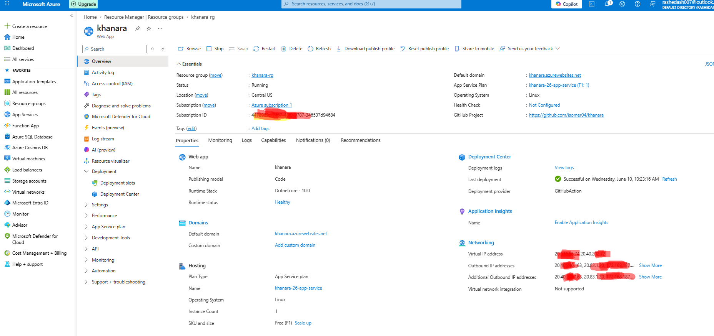
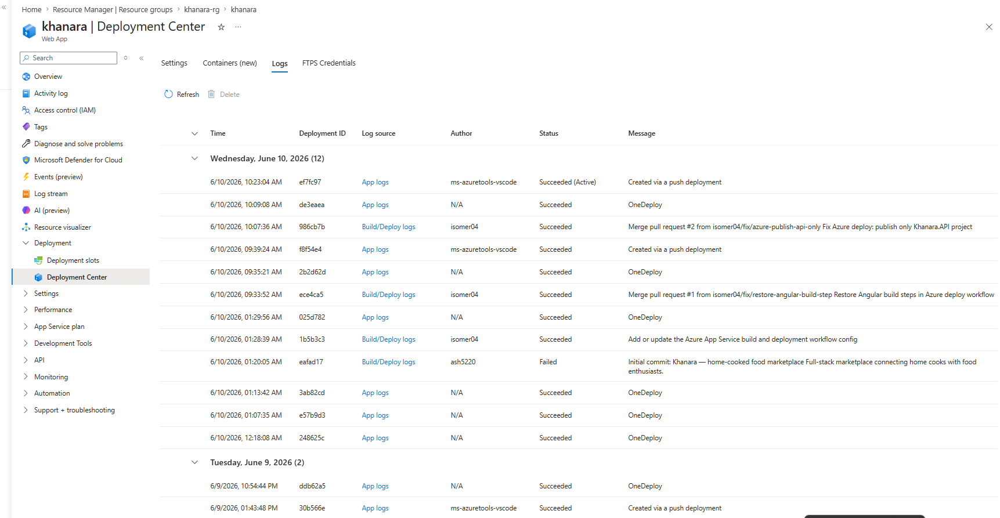
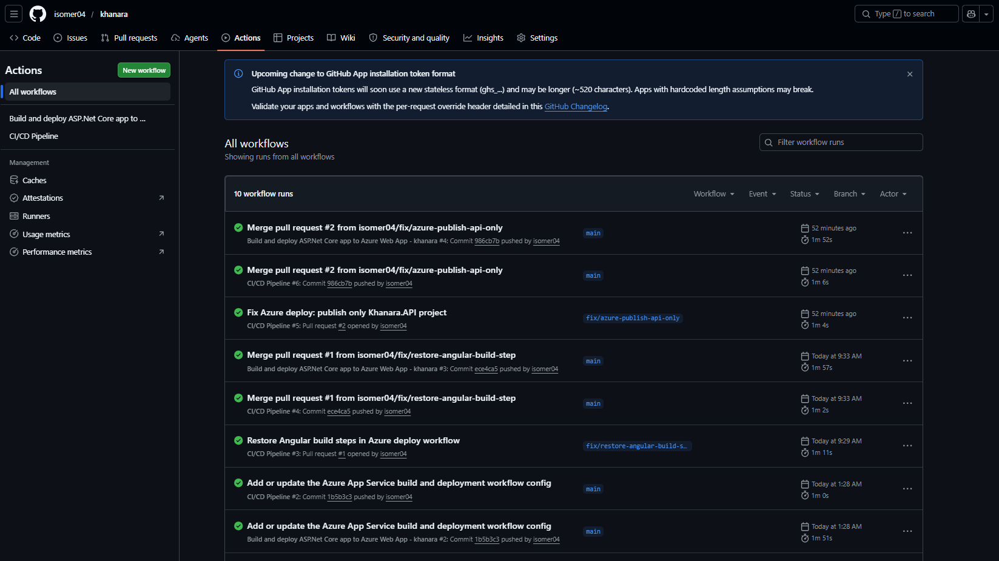

# Deployment Guide

> The app is deployed to an Azure Web App (`khanara.azurewebsites.net`) with a SQL Server database. Deploys run automatically via GitHub Actions (`.github/workflows/main_khanara.yml`) on every push to `main`.

---

## Live deployment (Azure)

**Live app:** [khanara.azurewebsites.net](https://khanara.azurewebsites.net)

The API and the bundled Angular SPA run on **Azure App Service (Linux, .NET 10)**, backed by **Azure SQL Database**. Every push to `main` deploys automatically through GitHub Actions using **OIDC federated credentials** — no publish-profile passwords or long-lived secrets are stored anywhere.

| | |
|---|---|
| **Hosting** | Azure App Service · Linux · .NET 10 |
| **Database** | Azure SQL Database |
| **CI/CD** | GitHub Actions → `azure/webapps-deploy@v3` |
| **Auth to Azure** | OpenID Connect (federated identity, passwordless) |
| **TLS** | Managed certificate on `*.azurewebsites.net` |

### Azure App Service — Overview



### Deployment Center — automated GitHub Actions deploy



### GitHub Actions — build & deploy pipeline



> Screenshots live in [`docs/screenshots/`](screenshots/) — see the README there for exactly what to capture and a quick privacy note before committing.

---

## How the production deploy works

The `main_khanara.yml` workflow:

1. Builds the Angular client (`npm ci && npm run build`) — the output goes directly into `backend/wwwroot/` (configured in `client/angular.json`)
2. Builds and publishes the .NET API (`dotnet publish`), which bundles `wwwroot/` — so the API serves the SPA itself (`FallbackController` routes non-API requests to `index.html`)
3. Logs in to Azure via OIDC (the `AZUREAPPSERVICE_*` secrets) and deploys the published output to the `khanara` Web App

There is a separate workflow, `.github/workflows/ci.yml`, that runs build/test/lint/security checks on PRs — it never deploys.

---

## Prerequisites (manual deploy)

- .NET 10 SDK
- Node.js 24 LTS (for building the frontend; Angular 21 supports ^20.19.0 || ^22.12.0 || ^24.0.0)
- A SQL Server instance (Docker locally, Azure SQL in production)
- Cloudinary account (required)
- Stripe account with live keys configured

---

## Build

**Frontend first** (its output lands in `backend/wwwroot/`):
```bash
cd client
npm ci
npm run build
```

**Then backend:**
```bash
cd backend
dotnet publish -c Release -o ./publish
```

---

## Database

The app uses SQL Server via EF Core (`opt.UseSqlServer(...)` in `Program.cs`). Locally the database runs in Docker (`docker compose up -d`); in production it's an Azure-hosted SQL Server. Integration tests use in-memory SQLite and don't touch a real server.

Run migrations as part of your CI/CD pipeline — **not** on startup — to avoid race conditions when scaling horizontally:

```bash
dotnet ef database update --project backend/Khanara.API.csproj
```

If you keep `MigrateAsync()` in `Program.cs`, ensure only one instance runs at a time during deploy.

---

## Environment Variables

Set the following in your hosting environment (never commit these):

```
ConnectionStrings__DefaultConnection=...
TokenKey=<64+ char random string>
Jwt__Issuer=https://your-api-domain.com
Jwt__Audience=https://your-frontend-domain.com
CloudinarySettings__CloudName=...
CloudinarySettings__ApiKey=...
CloudinarySettings__ApiSecret=...
Stripe__SecretKey=sk_live_...
Stripe__WebhookSecret=whsec_...
Cors__AllowedOrigins__0=https://your-frontend-domain.com
```

---

## Stripe Webhooks

When re-enabling the card payment UI:

1. Create a webhook endpoint in the Stripe dashboard pointing to `https://your-api/api/payments/webhook`
2. Subscribe to `checkout.session.completed` and `charge.refunded`
3. Copy the signing secret into `Stripe:WebhookSecret`

---

## Security Checklist

- [ ] `TokenKey` is at least 64 characters and generated securely
- [ ] HTTPS enforced (reverse proxy or hosting platform)
- [ ] `Cors:AllowedOrigins` locked to production frontend URL only
- [ ] Stripe webhook signature verification enabled (handled by `PaymentsController`)
- [ ] Image upload size limit (5 MB) reviewed for production load
- [ ] `DailyReset:CutoverHourUtc` set to an appropriate off-peak hour for your market
- [ ] Horizontal scaling: migrations moved out of startup

---

## Background Services

Two hosted services run in the background — ensure your deployment keeps a single always-on instance:

| Service | Schedule | Purpose |
|---|---|---|
| `AbandonedOrderCleanupService` | Every 15 min | Cancels Pending Stripe orders >45 min old, restores portions |
| `DailyPortionsResetService` | Every 30 min | Resets dish portions once per day at `DailyReset:CutoverHourUtc` |

These are in-process `IHostedService` implementations. If you move to a job queue (Hangfire, Azure Functions, etc.), remove them from `Program.cs`.
