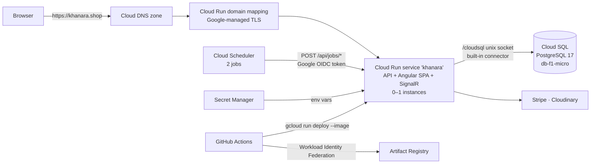

# Khanara on Google Cloud: Deployment Plan

**Verdict: yes, Khanara fits comfortably on GCP.** The recommended setup runs for about **$10–11 a month**. The $300 free-trial credit covers the whole 90-day trial with about $270 left over, and the monthly cost stays small after the trial.

- **Domain:** `khanara.shop` (verified through the khanara.shop Cloud Identity account)
- **Region:** `us-central1`
- **Infrastructure:** Terraform in [`infra/terraform/`](../infra/terraform)
- **Deploys:** [`.github/workflows/deploy-gcp.yml`](../.github/workflows/deploy-gcp.yml)

---

## 1. Context

The app ran on Azure App Service with Azure SQL until the Azure free tier expired, and it has been offline since. The new setup uses three things we already have:

- the `khanara.shop` domain
- a Google Cloud Identity account on that domain, which also gives us a GCP **organization**
- $300 of GCP free-trial credit, valid for 90 days

We want the site back online, stay well inside the credit, and keep the monthly cost low once the trial ends.

The app is a single deployable: the .NET 10 API serves the Angular build from `wwwroot`. That keeps the SPA and the API on one origin, so the `SameSite=Strict` refresh cookie, the relative `api/` and `hubs/` URLs, and SignalR all work unchanged. It therefore fits in **one container**.

---

## 2. Architecture



| Component | Configuration |
|---|---|
| **Cloud Run** | 1 vCPU / 512 MiB, request-based billing, min 0 / max 1 instances, 3600 s timeout for WebSockets, session affinity, startup CPU boost |
| **Cloud SQL** | PostgreSQL 17, Enterprise edition, `db-f1-micro`, zonal, 10 GB SSD (autoresize to 20), 7 daily backups, deletion protection, public IP with **no authorized networks** |
| **Secret Manager** | 6 secrets. The DB connection string and JWT key are generated by Terraform; the 4 Stripe/Cloudinary keys come from `terraform.tfvars` |
| **Cloud Scheduler** | `abandoned-order-cleanup` every 15 min, `daily-portions-reset` daily at 03:00 UTC |
| **Cloud DNS** | Zone for `khanara.shop`: apex A/AAAA, `www` CNAME, plus your existing TXT/MX records |
| **Artifact Registry** | Docker repo; keeps the 5 newest images and deletes the rest after 7 days |
| **IAM** | Runtime, scheduler and deployer service accounts; a GitHub OIDC pool limited to `isomer04/khanara@main` |
| **Budget** | $25/month alert at 50/90/100 % actual and 100 % forecast, measured **before** credits |

---

## 3. Key decisions

| Decision | Chosen | Instead of | Why |
|---|---|---|---|
| Compute | Cloud Run, scale to zero | VM, GKE, App Engine | One container, free tier covers the traffic, no servers to patch |
| Database | **PostgreSQL** (`db-f1-micro`, ~$9/month) | Cloud SQL for SQL Server Express | SQL Server needs at least 1 vCPU / 3.75 GB, about $50/month even though the Express license is free. The EF Core model has no SQL Server-specific features, so the switch was one package, one line and a regenerated migration |
| Background jobs | Cloud Scheduler → `/api/jobs/*` | In-process timers with an always-on instance | An always-on 1 vCPU instance costs about $45/month. With request-based billing the CPU is throttled between requests, so timers wouldn't fire reliably |
| Instances | Max **1** | Autoscaling | SignalR order presence lives in memory and there is no backplane (Redis would add about $35/month). This also makes startup migrations race-free |
| DB connectivity | Built-in Cloud SQL connector (unix socket) | Private IP + VPC + Direct VPC egress | No VPC, peering range or connector to pay for or maintain. With no authorized networks, the only way in is the IAM-checked connector |
| Custom domain | Cloud Run domain mapping (free) | Global HTTPS load balancer (~$18/month) | The domain mapping is free. It is still in preview; the load balancer is the upgrade path (§9) |
| Public access | `invoker_iam_disabled = true` | `allUsers` → `run.invoker` | Orgs created after May 2024 enforce *domain-restricted sharing*, which rejects `allUsers` bindings |
| CI auth | Workload Identity Federation | Service-account JSON key | The same secure-by-default policies block SA key creation, and WIF is keyless anyway |
| Secrets in Terraform | Write-only arguments (`*_wo`) + ephemeral random passwords | `random_password` in state | The DB password and JWT key never land in Terraform state or plan files |
| Region | `us-central1` | — | Tier-1 pricing, supports domain mappings, and holds the free-tier resources |

---

## 4. Cost estimate (us-central1, per month, before credits)

| Item | Basis | Cost |
|---|---|---|
| Cloud SQL `db-f1-micro` | $0.0105/h × 730 h | ~$7.67 |
| Cloud SQL storage | 10 GB SSD × $0.17 | $1.70 |
| Cloud SQL backups | 7 small daily backups | ~$0.10 |
| Cloud Run | Free tier: 180k vCPU-s, 360k GiB-s, 2M requests. The scheduler wake-ups plus light traffic stay well under it | $0 |
| Cloud Scheduler | 2 jobs; 3 free per billing account | $0 |
| Artifact Registry | ≤5 images; 0.5 GB free | $0–0.10 |
| Secret Manager | 6 secrets, ~10 versions; 6 free | ~$0.30 |
| Cloud DNS | 1 zone + queries | ~$0.20 |
| Egress | Small; images are cached as immutable | $0–0.50 |
| **Total** | | **≈ $10–11 / month (≈ $32 over the 90-day trial)** |

For comparison: keeping SQL Server and an always-on instance would cost about **$95–100/month**. That would use up the whole $300 in the trial's 90 days.

> **Cost watch-outs**
> - An open SignalR WebSocket counts as an active request, and Cloud Run bills while it's open (about $0.09/hour beyond the free tier). This PR makes the order pages close the socket when you leave them. The budget alert is the backstop.
> - The `EXCLUDE_ALL_CREDITS` budget shows the real run rate even while the credit pays. Without it, alerts would never fire during the trial.

---

## 5. What changed in the app

| Area | Change |
|---|---|
| **Database** | `Microsoft.EntityFrameworkCore.SqlServer` → `Npgsql.EntityFrameworkCore.PostgreSQL` 10.0.3. Migrations regenerated as a single Postgres `InitialCreate` (the Azure database is gone, so there's no data to carry over). Check-constraint columns are quoted, because Postgres folds unquoted names to lower case. Added `AppDbContextFactory` so `dotnet ef` works without the app's secrets |
| **Seed fix** | `Seed.cs` passed a `CuisineTag[]` where Npgsql expects the `List<CuisineTag>` column type, which crashed startup seeding on Postgres. SQLite tests can't catch this; it was found by running the image against Postgres 17 |
| **Background jobs** | Job logic moved into `AbandonedOrderCleanupJob` and `DailyPortionsResetJob`. The timer services still call them when `Jobs:RunInProcess=true` (the default, for local dev). On Cloud Run, Cloud Scheduler calls `JobsController` instead |
| **Job auth** | New `SchedulerOidc` JWT scheme validates Google-signed tokens: issuer `accounts.google.com`, audience `https://khanara.shop/api/jobs`. The `SchedulerJob` policy also pins `email` to the scheduler service account with `email_verified`. App user JWTs are rejected |
| **Once-a-day reset** | New `JobRuns` table. The reset claims the day inside a transaction, so Scheduler retries, duplicate deliveries or manual runs can't hand back portions that were already sold. The old in-memory guard didn't survive restarts |
| **Hosting** | `/health` endpoint (not `/healthz`: Cloud Run reserves paths ending in `z`); `AllowedHosts` no longer pinned to the Azure host; `www` → apex redirect; migration failure is fatal outside Development, so a broken revision never takes traffic; startup check that the jobs config is present when timers are off |
| **Client** | Order detail and order chat pages close the SignalR connection on exit (cost, see §4) |
| **Local dev** | `docker-compose.yml` now runs `postgres:17` on port 5433 (`POSTGRES_PASSWORD` in `.env`) |
| **Packaging** | Root `Dockerfile` (Node 24 → .NET 10 SDK → ASP.NET runtime, non-root, port 8080) and `.dockerignore`, which keeps `appsettings.Development.json`, `publish/` and `.env*` out of the image |
| **CI/CD** | `deploy-gcp.yml` runs after CI passes on a push to `main`: WIF auth → build and push → `gcloud run deploy --image` → `/health` smoke test. It is skipped until the GitHub variables exist. The old Azure workflow stays disabled |

Forwarded headers are turned on through `ASPNETCORE_FORWARDEDHEADERS_ENABLED=true`, set in Terraform. The auth rate limiter then partitions by the real client IP instead of Google's front end, and HSTS is emitted.

---

## 6. Terraform layout

```
infra/terraform/
├── bootstrap/        # local state, run once: base APIs + versioned state bucket
└── prod/             # GCS backend: everything else
    ├── main.tf               APIs, shared locals
    ├── iam.tf                service accounts, GitHub WIF pool/provider, deployer roles
    ├── cloudsql.tf           Postgres instance, database, user (write-only password)
    ├── secrets.tf            6 secrets, generated and tfvars-supplied values, accessor IAM
    ├── cloudrun.tf           service, env vars, secret refs, Cloud SQL volume, probes
    ├── scheduler.tf          2 OIDC-authenticated HTTP jobs
    ├── dns.tf                zone, records, domain mappings (apex + www)
    ├── artifact_registry.tf  repo + cleanup policies
    ├── budget.tf             budget alerts (credits excluded)
    └── outputs.tf            URLs, name servers, GitHub Actions variables
```

- **Providers:** `hashicorp/google ~> 8.4`, `hashicorp/random ~> 3.9`, Terraform ≥ 1.11 (for write-only arguments).
- **Image ownership:** CI owns the container image. Terraform ignores image changes (`lifecycle.ignore_changes`), so deploys never show up as drift.
- **Validation:** both stacks pass `terraform validate` and `terraform fmt -check`.

---

## 7. First-time runbook

Use PowerShell unless noted. Replace `khanara-prod-XXXX` with your project ID.

### Phase 0: Isolate the khanara.shop identity

Your default gcloud login belongs to another account and project. Give this project its own gcloud config directory, so its login **and** its Application Default Credentials never overwrite the other ones.

```powershell
$env:CLOUDSDK_CONFIG = "$HOME\.gcloud-khanara"   # set this in every khanara shell
gcloud auth login                                  # sign in as your @khanara.shop admin
gcloud organizations list                          # note ORG_ID
gcloud billing accounts list                       # note the free-trial BILLING_ACCOUNT
gcloud projects create khanara-prod-XXXX --organization ORG_ID --name Khanara
gcloud billing projects link khanara-prod-XXXX --billing-account BILLING_ACCOUNT
gcloud config set project khanara-prod-XXXX
gcloud auth application-default login              # credentials Terraform will use
gcloud auth application-default set-quota-project khanara-prod-XXXX
$env:GOOGLE_APPLICATION_CREDENTIALS = "$env:CLOUDSDK_CONFIG\application_default_credentials.json"
gcloud domains list-user-verified                  # must list khanara.shop
```

- **Domain not listed?** Run `gcloud domains verify khanara.shop` and add the TXT record it gives you at your registrar.
- **Permissions:** your account needs *Project Creator* on the org, *Billing Account User* on the billing account, and *Billing Account Costs Manager* for the budget. The Cloud Identity super admin can grant these under IAM → organization.
- **Before moving DNS:** write down every record your registrar serves today (`nslookup -type=TXT khanara.shop`, `-type=MX`, and any CNAMEs). The Cloud Identity `google-site-verification` TXT **must** be carried over.

**Using an existing Google account instead.** This is how the first deployment is done, from the account that holds the credit (`My Billing Account`):
- Skip the separate `CLOUDSDK_CONFIG` folder.
- Create the project under that account's organization, and pass `--project` explicitly so your default gcloud project doesn't change.
- Leave `enable_domain_mapping` at its default (`false`) until `gcloud domains list-user-verified` lists `khanara.shop` for that account (see Phase 5).

### Phase 1: Bootstrap (state bucket)

```powershell
cd infra/terraform/bootstrap
copy terraform.tfvars.example terraform.tfvars    # set project_id
terraform init
terraform apply                                    # note the state_bucket output
```

This stack keeps local state. Back up `terraform.tfstate`; it's gitignored.

### Phase 2: Main infrastructure

```powershell
cd ../prod
copy backend.hcl.example backend.hcl              # bucket = <state_bucket>
copy terraform.tfvars.example terraform.tfvars    # project_id, billing_account, cloudinary_cloud_name, third_party_secrets, apex_txt_records, mx_records
terraform init -backend-config=backend.hcl
terraform plan -out tfplan
terraform apply tfplan                             # Cloud SQL takes ~10–15 min
```

`terraform plan` rejects empty `third_party_secrets` values, so fill in all four first. The Stripe webhook endpoint doesn't exist yet, so give `stripe-webhook-secret` a temporary value such as `"pending"`; Phase 3 replaces it.

The service starts on Google's placeholder "hello" image, which is served at the `service_url` output.

### Phase 3: Third-party secrets

1. In Stripe, create a webhook endpoint for the `stripe_webhook_url` output with the events `checkout.session.completed` and `charge.refunded`. Stripe doesn't need the site to be live for this.
2. Replace the temporary `stripe-webhook-secret` in `terraform.tfvars` with the endpoint's signing secret (`whsec_...`), bump `third_party_secrets_version`, and apply.

The variable is ephemeral, so the values go straight to Secret Manager through write-only arguments and never reach the state or plan file. That also means Terraform can't detect an edited value: bump `third_party_secrets_version` every time you change one. Cloud Run pins these versions too, so the apply rolls out a revision that reads them.

### Phase 4: Connect GitHub and deploy

```powershell
(terraform output -json github_actions_variables | ConvertFrom-Json).PSObject.Properties |
  ForEach-Object { gh variable set $_.Name --body $_.Value --repo isomer04/khanara }
```

Merge this PR. CI runs, then **Deploy to Cloud Run** builds the image and rolls it out. You can also run the workflow from the Actions tab on `main`. The first start applies the migration and seeds the demo catalog.

### Phase 5: DNS cutover

1. Once `gcloud domains list-user-verified` lists `khanara.shop`, set `enable_domain_mapping = true` in `prod/terraform.tfvars`, then plan and apply. This creates the apex and `www` mappings.
2. If DNSSEC is on at your registrar, turn it off first.
3. Set the registrar's nameservers to the four `dns_name_servers` outputs.
4. Wait for propagation: `nslookup -type=NS khanara.shop 8.8.8.8`.
5. Watch the certificate: `gcloud beta run domain-mappings describe --domain khanara.shop --region us-central1`. This usually takes 15–60 minutes and can take up to 24 hours.
6. Check that Cloud Identity still shows the domain as verified.

### Phase 6: After go-live

- Upgrade the billing account to a paid account **before day 90**. Otherwise resources are stopped when the trial ends.
- Deal with the seeded demo accounts (see §9).

---

## 8. Verification checklist

- [ ] `curl -sI https://khanara.shop/health` returns `200` **and** a `strict-transport-security` header. The header proves forwarded headers work.
- [ ] `https://www.khanara.shop` redirects (301) to `https://khanara.shop`.
- [ ] Cloud Run logs show `Applying migration '…_InitialCreate'` and no errors.
- [ ] `curl -X POST https://khanara.shop/api/jobs/daily-portions-reset` returns `401`.
- [ ] `gcloud scheduler jobs run khanara-abandoned-order-cleanup --location us-central1` shows a `200` in the logs. Same for the reset job, whose second run the same day reports `skipped: true`.
- [ ] Log in, refresh the page, and stay logged in (refresh cookie works). Open an order: devtools shows the `hubs/order` WebSocket. Leave the order and it closes.
- [ ] Eleven quick failed logins trigger `429` for you only, which shows the per-IP limiter sees real IPs.
- [ ] Stripe dashboard → *Send test webhook* returns `200`.
- [ ] `terraform plan` shows **No changes** after a CI deploy.
- [ ] Billing → Budgets lists "khanara monthly".

---

## 9. Operations, risks and follow-ups

**Rotation**
- Bump `db_password_version` or `token_key_version` in `terraform.tfvars` and apply. Terraform generates new values for both the Cloud SQL user and the secret. Cloud Run pins the versions of these two secrets, so the same apply rolls out a revision that reads the new value.
- Changing the connection settings in `secrets.tf` (for example the pool size) rotates the DB password the same way, because the password is only ever written together with the secret.
- A JWT key rotation logs everyone out.
- If an apply ever fails between updating the DB user and writing the secret, bump the version again. Both get a fresh matching password.

**Third-party secrets.** Edit `third_party_secrets` in `terraform.tfvars` and bump `third_party_secrets_version`. Don't add versions with `gcloud secrets versions add`: Cloud Run is pinned to the Terraform-managed version and won't see them. Replaced versions stay in Secret Manager (`deletion_policy = "ABANDON"`) so a traffic rollback to an older revision still works; destroy old ones with `gcloud secrets versions destroy` once you no longer need them.

**Rollback.** Revert traffic with `gcloud run services update-traffic khanara --region us-central1 --to-revisions <previous-revision>=100`.

**Teardown.**
1. Set `deletion_protection = false` and `deletion_protection_enabled = false` in `cloudsql.tf` and apply.
2. Run `terraform destroy` in `prod`.
3. Delete the state bucket.

**Risks and limitations**
- **Domain mappings are in preview:** there's some added latency, and TLS 1.0/1.1 can't be disabled. If that becomes a problem, add a global HTTPS load balancer with a serverless NEG (~$18/month).
- **Cold starts:** after idle time the first request takes about 3–8 s, and Stripe webhooks can hit one (Stripe retries). The 15-minute cleanup job keeps the instance warm most of the time. Setting `min_instance_count = 1` removes cold starts for a few dollars a month.
- **`db-f1-micro`:** a shared core, 25 connections (the app caps its pool at 10), and no SLA.
- **Max 1 instance:** scaling out needs a SignalR backplane and migrations moved out of startup.

**Follow-ups (not in this PR)**
- **Seeded demo accounts:** `Data/Seed.cs` creates 10 catalog cook accounts whose shared password is committed to this public repo. Anyone could log in as those cooks and edit their dishes. Change those passwords after the first deploy, or gate the seeding behind configuration. The admin and moderator test accounts are *not* created on a fresh database, because the catalog cooks exist by the time that check runs.
- Add a CI job that applies the migrations to a `postgres:17` service container, since the SQLite-based tests don't exercise Npgsql.
- Delete the disabled Azure workflow (`main_khanara.yml`) once GCP is live.
- Pin the WIF condition to the numeric repository ID so the deploy identity survives repo renames.
